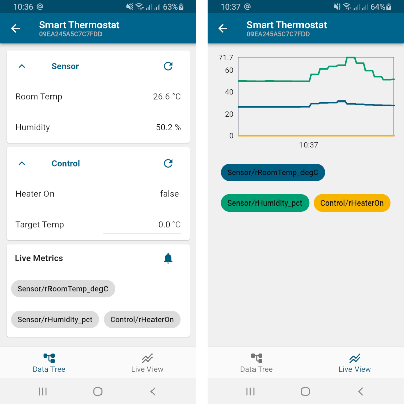

# ThingSet App

This app devloped with [Flutter](https://docs.flutter.dev/) provides a generic user inferface for
any device supporting the [ThingSet protocol](https://thingset.io).

The connection can be direct (via Bluetooth) or through a cloud backend (via WebSockets).



## Run the app on a desktop computer

```
flutter run -d linux
```

## License

This software is released under the [Apache-2.0 License](LICENSE).
